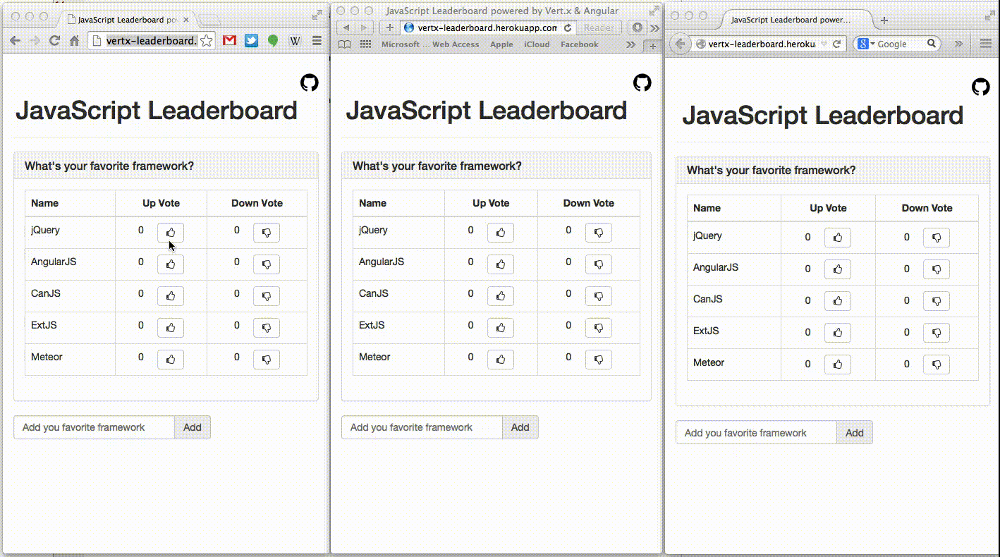

vertx-leaderboard  [](https://heroku.com/deploy)
=================
Sample app demonstrating the power of [Vert.x's](http://vertx.io/) *distributed event bus* & [AngularJS's](http://angularjs.org) *data binding*

## Introduction
This sample app demonstrates the power of Vert.x distributed event bus along with AngularJS data binding.
Launch the app in multiple tabs or browser windows, play with it & see what happens. Cool eh?

### Demo


## Running the app on cloud
The easiest way to test this app is running it on Heroku.
* Get a Free developer account with Heroku (if you don't have one)
* Fork this repo and/or Click on the "Deploy to Heroku" button at the top
* Navigate to the deployed application url

## Running the app locally (if you have vertx installed)
```bash
vertx run server.js
```
* Navigate to [http://localhost:9090](http://localhost:9090)


### Build pack
Thanks to the build pack - https://github.com/mthenw/heroku-buildpack-vertx.git for easier heroku deployment :)